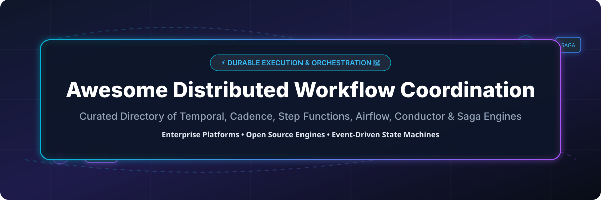

# Awesome-Distributed-Application-Workflow-Coordination

# Awesome-Distributed-Application-Workflow-Coordination 🧩 🔄



  





  
  
  
  
  
  



---

## 🌟 Top Distributed Application Workflow Coordination Ecosystem

**Curated List of Commercial Workflow Orchestration Platforms & Open-Source Coordination Engines**  
*Focused on Durable Execution, Saga Patterns, State Machines, Event-Driven Workflows, Long-Running Processes & Self-Hosted Coordination*

**Last updated: October 2026** 📅

---

### 📌 Overview & SEO Summary
Welcome to the ultimate curated directory of **distributed workflow coordination platforms**, **open-source durable execution engines**, and **state machine orchestration frameworks**. Whether you are looking for enterprise-grade commercial solutions (such as *AWS Step Functions*, *Temporal Cloud*, and *Camunda*), or self-hostable open-source alternatives (like *Temporal*, *Cadence*, and *Conductor*), this list covers category leaders, saga patterns, and privacy-respecting workflow coordination.

**Key Market Context:**
- **Temporal** is the **leading open-source durable execution platform**, with **15K+ GitHub stars** and **used by Netflix, Snap, and Stripe** for mission-critical workflows.
- **AWS Step Functions** processes **over 10 billion state transitions per month**, making it the **most widely used managed workflow service**.
- **Cadence** (Uber's original workflow engine) and **Temporal** (founded by the Cadence team) are the **two dominant open-source durable execution engines**.

---

## 📑 Table of Contents
- [🏢 SaaS & Commercial Platforms](#-saas--commercial-platforms)
- [🔓 Open-Source GitHub Projects](#-open-source-github-projects)
- [🛠️ How to Contribute](#%EF%B8%8F-how-to-contribute)
- [📊 Star History](#-star-history)
- [🤝 Support & Sponsorship](#-support--sponsorship)
- [⚠️ Disclaimer](#%EF%B8%8F-disclaimer)

---

## 🏢 SaaS / Commercial Platforms

The distributed workflow coordination market spans **hyperscaler workflow services** (AWS Step Functions, Azure Logic Apps) that provide **fully managed state machines with deep cloud integration**, **durable execution platforms** (Temporal Cloud, Cadence Cloud, Orkes Conductor) that offer **code-first workflow orchestration**, and **BPMN-based platforms** (Camunda, Pega) that focus on **business process modeling and human-in-the-loop workflows**. **AWS Step Functions** charges **$0.025 per 1,000 state transitions** . **Temporal Cloud** charges **$100/month for 1M actions** with **$0.01 per additional 1,000 actions** . **Camunda Cloud** offers **$0/month for 10 process instances** with **Professional at $100/month**. **Inngest** charges **$50/month for 50K runs**.

| SaaS / Commercial Platform | Company / Owner | Valuation / Market Cap | Standard Edition Starting Price | Free Tier / Free Trial Limits | Description |
| :--- | :--- | :--- | :--- | :--- | :--- |
| **[AWS Step Functions](https://aws.amazon.com/step-functions/)** ☁️ | Amazon | ~$2.0 Trillion | **$0.025 per 1,000 state transitions**  | **Free tier: 4,000 state transitions/month for 12 months**  | **AWS-native workflow orchestration** — **Visual state machine builder** with **200+ AWS service integrations** . **Standard and Express workflows** for long-running and high-volume use cases . **Processes over 10 billion state transitions per month** . **The most widely used managed workflow service** . |
| **[Temporal Cloud](https://temporal.io/)** ⏳ | Temporal Technologies | ~$1.5 Billion | **$100/month** (1M actions); **$0.01 per 1,000 additional actions**  | **Free: 1M actions/month, 10 namespaces**  | **Durable execution platform** — **Write workflows in Go, Java, TypeScript, Python, PHP, and .NET** . **Automatic retries, timeouts, and state persistence** . **Used by Netflix, Snap, Stripe, and Datadog** . **The most developer-friendly workflow platform** . |
| **[AWS Simple Workflow Service (SWF)](https://aws.amazon.com/swf/)** ☁️ | Amazon | ~$2.0 Trillion | **$0.00002 per workflow execution** + **$0.000005 per activity task**  | **Free tier: 1,000 workflow executions/month**  | **AWS-native workflow service (legacy)** — **The predecessor to Step Functions** . **Still used for legacy applications** . **AWS recommends Step Functions for new projects** . |
| **[Camunda Cloud (Zeebe)](https://camunda.com/)** 🎛️ | Camunda | Private | **$100/month** (Professional); **Free: 10 process instances**  | **Free: 10 process instances/month**  | **BPMN-based workflow orchestration** — **Visual process modeling with BPMN 2.0** . **Zeebe engine for high-throughput orchestration** . **Human task management and decision automation (DMN)** . **The most business-friendly workflow platform** . |
| **[Orkes Conductor](https://orkes.io/)** 🎼 | Orkes | Private | **Custom pricing** (based on workflow executions) | **Free tier: 1,000 workflow executions/month**  | **Managed Netflix Conductor** — **Microservices orchestration** . **Visual workflow designer** . **Built on the open-source Netflix Conductor** . **The most enterprise-ready Conductor platform** . |
| **[Azure Logic Apps](https://azure.microsoft.com/en-us/products/logic-apps/)** 🔷 | Microsoft | ~$3.90 Trillion | **Consumption: $0.000025 per action**  | **Free tier: 4,000 actions/month**  | **Azure-native workflow automation** — **Visual designer with 400+ connectors** . **Consumption and Standard plans** . **Deep integration with Azure services and Microsoft 365** . |
| **[Inngest](https://www.inngest.com/)** ⚡ | Inngest | Private | **$50/month** (50K runs)  | **Free: 50K runs/month**  | **Event-driven workflow platform** — **Serverless background jobs and workflows** . **Step functions with automatic retries** . **The most developer-friendly event-driven platform** . |
| **[Prefect Cloud](https://www.prefect.io/)** 🌊 | Prefect | Private | **Free: 10,000 task runs/month**; **Paid from $100/month**  | **Free: 10,000 task runs/month**  | **Modern workflow orchestration** — **Python-native, dynamic workflows** . **Event-driven orchestration and real-time observability** . **The most Pythonic workflow platform** . |
| **[Cadence Cloud](https://cadenceworkflow.io/)** 🔄 | Uber | N/A (Open Source) | **Custom pricing** (via Uber) | **Open-source free forever**  | **Uber's workflow engine** — **The original durable execution platform** . **Powers Uber's mission-critical workflows** . **The foundation for Temporal** . **Proven at massive scale** . |
| **[Apache Airflow](https://airflow.apache.org/)** 🏛️ | Apache | N/A (Open Source) | **Free** (self-hosted); **Managed from $0.50/hour**  | **Open-source free forever**  | **The most widely adopted workflow orchestrator** — **DAG-based scheduling** . **34K+ GitHub stars** . **The standard for data pipeline orchestration** . |

---

## 🔓 Open-Source GitHub Projects

*Sorted by GitHub_Stars_Count (Descending)* 🌟

- **[Temporal](https://github.com/temporalio/temporal)**   
  **The leading open-source durable execution platform**, MIT licensed. **15K+ GitHub stars** — **write workflows in Go, Java, TypeScript, Python, PHP, and .NET** . **Automatic retries, timeouts, and state persistence** . **Used by Netflix, Snap, Stripe, Datadog, and Coinbase** for mission-critical workflows . **Scales to millions of concurrent workflows** . **The most developer-friendly workflow platform** — code-first, not configuration-first . **The definitive open-source workflow coordination engine** . ⏳

- **[Cadence](https://github.com/uber/cadence)**   
  **Uber's distributed workflow engine**, MIT licensed. **8K+ GitHub stars** — **the original durable execution platform** . **Powers Uber's mission-critical workflows** — **driver onboarding, trip processing, and payment workflows** . **The foundation for Temporal** — the Temporal team forked Cadence in 2019. **Proven at massive scale** . **The pioneer of durable execution** . 🔄

- **[Apache Airflow](https://github.com/apache/airflow)**   
  **The most widely adopted workflow orchestration platform**, Apache-2.0 licensed. **34.5K+ GitHub stars** — **DAG-based scheduling with Python-defined workflows** . **Massive ecosystem of providers and operators** . **The de facto standard for data pipeline orchestration** . **The foundation of modern data engineering** . 🏛️

- **[Netflix Conductor](https://github.com/Netflix/conductor)**   
  **Microservices orchestration engine**, Apache-2.0 licensed. **8K+ GitHub stars** — **the original microservices orchestrator** . **JSON DSL for workflow definition** . **Visual workflow designer** . **The foundation for Orkes Conductor** . **The most battle-tested microservices orchestrator** . 🎼

- **[Zeebe (Camunda 8)](https://github.com/camunda/zeebe)**   
  **Distributed workflow engine for microservices orchestration**, Apache-2.0 licensed. **3K+ GitHub stars** — **BPMN 2.0 execution engine** . **Horizontally scalable** with **gRPC API** . **The most business-friendly open-source workflow engine** . 🎛️

- **[Flowable](https://github.com/flowable/flowable-engine)**   
  **BPMN, DMN, and CMMN engine**, Apache-2.0 licensed. **3K+ GitHub stars** — **the most complete open-source BPM suite** . **Supports BPMN 2.0, DMN, and CMMN** . **Enterprise-grade workflow orchestration** . 🔧

- **[Kestra](https://github.com/kestra-io/kestra)**   
  **Declarative, YAML-defined orchestration**, Apache-2.0 licensed. **The most declarative open-source orchestrator** — **language-agnostic workflows** . **Event-driven and schedule-based triggers** . **Scales from simple flows to data pipelines** . 📝

- **[Windmill](https://github.com/windmill-labs/windmill)**   
  **Developer platform to turn scripts into workflows and UIs**, AGPL-3.0 licensed. **12,931 GitHub stars** — **13x faster than Airflow** . **Turn Python, TypeScript, Go, Bash, or SQL scripts into internal apps and workflows** . **Auto-generated UIs** . **The most developer-friendly orchestration platform** . ⚡

- **[Dagster](https://github.com/dagster-io/dagster)**   
  **Data orchestration platform for the modern data stack**, Apache-2.0 licensed. **10.2K+ GitHub stars** — **asset-centric orchestration** . **Software-defined assets, partitions, and typed I/O** . **Built-in observability, lineage, and data quality** . 🧱

- **[Conductor OSS (Orkes)](https://github.com/conductor-oss/conductor)**   
  **Open-source microservices orchestration engine**, Apache-2.0 licensed. **The community fork of Netflix Conductor** maintained by Orkes . **JSON DSL, visual designer, and 100+ integrations** . **The most actively maintained Conductor distribution** . 🚀

---

## 🛠️ How to Contribute

Contributions are welcome! Follow these steps to submit new workflow coordination platforms or open-source orchestration software:

1. 🍴 **Fork** the repository.
2. 📝 **Add/edit** entries in `README.md` maintaining table/list structure and formatting.
3. 🔗 Include project title, official website/GitHub link, exact Stars_Count, license, and brief description.
4. 🚀 Submit a **Pull Request** with a descriptive summary of your changes.

---

## 📊 Star History



---

## 🤝 Support & Sponsorship

If you find this distributed workflow coordination repository useful, please consider supporting the project:

- ⭐ **Star** this repository to increase visibility!
- 🔀 **Fork** and share with fellow platform engineers, backend developers, and open-source advocates.
- ☕ **Sponsor & Buy Me a Coffee**: Support ongoing open-source curation via the [GitHub Sponsor Dashboard](https://github.com/sponsors/ishandutta2007).

---

## ⚠️ Disclaimer

- This is a **community-curated** list — not exhaustive and not an endorsement. ℹ️
- **Temporal is the leading open-source durable execution platform** with **15K+ GitHub stars** and **used by Netflix, Snap, Stripe, and Datadog** . **Cadence is Uber's original workflow engine** — **Temporal was forked from Cadence in 2019** .
- **AWS Step Functions charges $0.025 per 1,000 state transitions** — **model your workflow volume** before committing. **Temporal Cloud charges $100/month for 1M actions** with **$0.01 per 1,000 additional actions** .
- **Open-source workflow engines are not turnkey** — they require **deployment, database configuration (Cassandra, MySQL, or PostgreSQL), and ongoing maintenance** . **Temporal requires a persistence store and visibility store** . **Always validate workflow durability and failover with a proof-of-concept** before production deployment . 🧩

---



  <b>Made with ❤️ for platform engineers, backend developers, and open-source workflow coordination advocates.</b>

